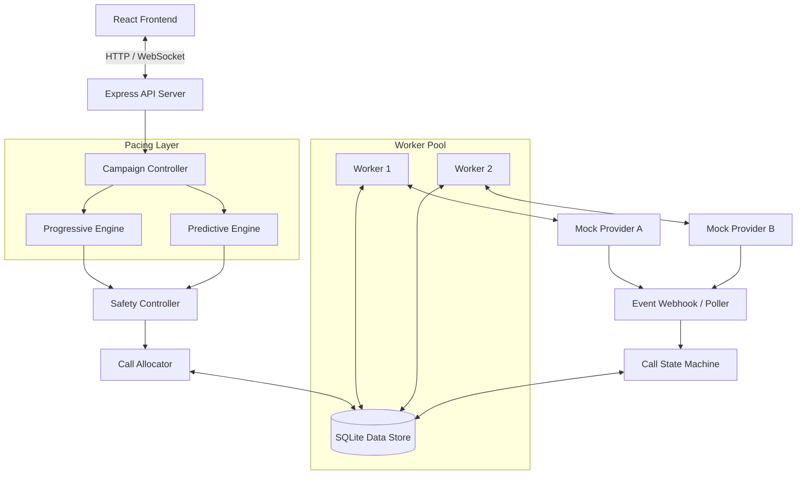
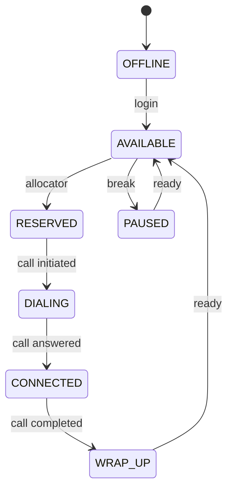
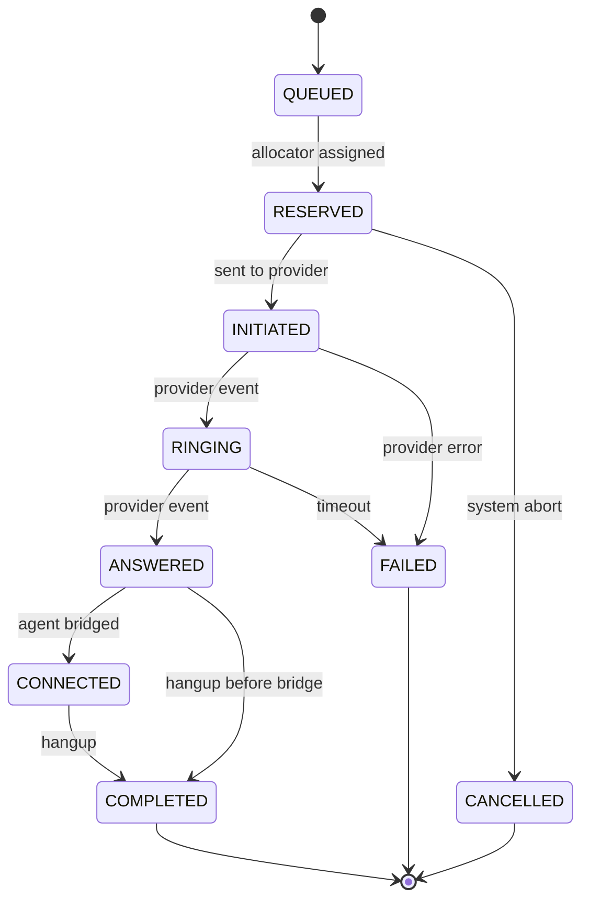

# SmartDialer Architecture & Design

## 1. System Architecture

The SmartDialer is built as a single-node prototype that emulates a distributed, multi-worker system. It uses an SQLite database as the central state store, simulating how independent workers would interact with a shared data layer (like PostgreSQL or Redis in a production system).



### Distributed System Emulation (Concurrency)
To prove the system handles concurrency (e.g. two workers trying to reserve the same agent), we use **Optimistic Concurrency Control** via atomic SQL queries.
```sql
UPDATE agents 
SET status = 'RESERVED', worker_id = ?, version = version + 1 
WHERE id = ? AND status = 'AVAILABLE'
```
If two workers execute this simultaneously, only one will successfully update the row (affecting 1 row), while the other will affect 0 rows, preventing double-allocation.

---

## 2. Agent State Machine



---

## 3. Call State Machine

Handles the lifecycle of a call, including out-of-order and duplicate events from telecom providers.


*Note: Any out-of-order events (e.g. `RINGING` arriving after `COMPLETED`) are safely ignored by the state machine's strict precedence checks. Duplicate events are ignored via idempotency keys.*

---

## 4. Architecture Decisions

### Why SQLite?
**Problem**: We needed a state store that workers could concurrently access to demonstrate concurrency control, without the heavy overhead of setting up Postgres/Kafka for a local prototype.
**Solution**: SQLite in WAL (Write-Ahead Logging) mode. It allows concurrent reads and handles single-writer locks cleanly, making it perfect for demonstrating atomic state transitions on a single machine.
**Tradeoffs**: SQLite cannot scale horizontally across multiple physical servers. In a real environment, this would be replaced by PostgreSQL (for ACID state) and Redis (for fast pacing counters).

### Pacing Algorithm (Predictive)
**Approach**: We use a rule-based algorithm combined with an **Exponentially Weighted Moving Average (EWMA)** for the answer rate.
`Calls to initiate = (Target Connected Agents / Answer Rate) - Currently Active Calls`
**Why**: This is simpler and more deterministic than a black-box ML model. It reacts to dropping answer rates smoothly (due to EWMA) without wild oscillations.

### Safety Controller
**Approach**: The Pacing Engine *proposes* a number of calls. The Safety Controller *approves, reduces, or rejects* it.
**Why**: The algorithm might have a sudden bug, or the answer rate might drop to 1% (causing a proposal of 1000 calls for 10 agents). The Safety Controller enforces a hard ceiling (e.g., maximum oversubscription ratio of 1.5x) that cannot be bypassed.

### Worker Crashes & Stale State
**Problem**: What if a worker crashes immediately after bridging a call (ANSWERED), but before moving the agent to CONNECTED?
**Solution**: 
1. **Heartbeats**: Workers ping the DB. If a heartbeat is missing, the system runs a recovery loop.
2. **State Reconciliation**: Stuck calls (`INITIATED`/`RINGING` for too long) are marked `FAILED`, freeing the reserved agents.

## 5. Answers to Final Questions

### Scale Bottlenecks
Moving from 100 to 10,000 agents, the first thing to break will be **Database Contention on Updates**.
With 10,000 agents handling short calls, we might have thousands of state transitions per second. SQLite will lock and fail. Even PostgreSQL will struggle with thousands of concurrent row updates if not tuned perfectly.
**How to fix**: 
- Move ephemeral high-frequency state (Agent Status, Call Status) to Redis.
- Use a distributed queue (RabbitMQ/Kafka) for the Allocator instead of polling the database for pending borrowers.

### Utilization vs Safety
*How would you build a SmartDialer that gets as much of the utilization benefit of predictive dialing as possible, while retaining the deterministic safety characteristics of progressive dialing?*

I would use a **Dynamic Hybrid Model**. 
At the start of a campaign, or when answer rates are highly volatile, the dialer runs in **Progressive Mode**.
As the system collects statistically significant data for a specific campaign/time-of-day, it switches to **Predictive Mode**, but dynamically adjusts its over-dial ratio based on the real-time variance in answer rates. 
The Safety Controller acts as the deterministic boundary: no matter what the predictive engine says, the safety controller limits the calls strictly based on real-time connected calls and a mathematically safe drop-rate threshold, completely ignoring the predictive engine if it suggests anything risky.
